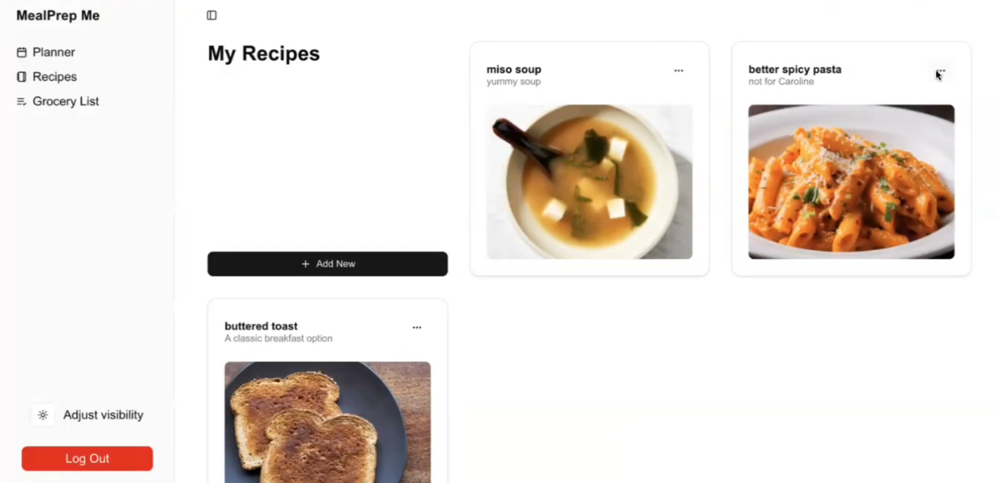
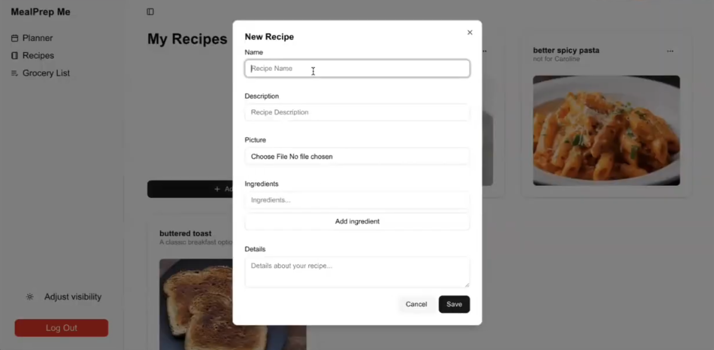
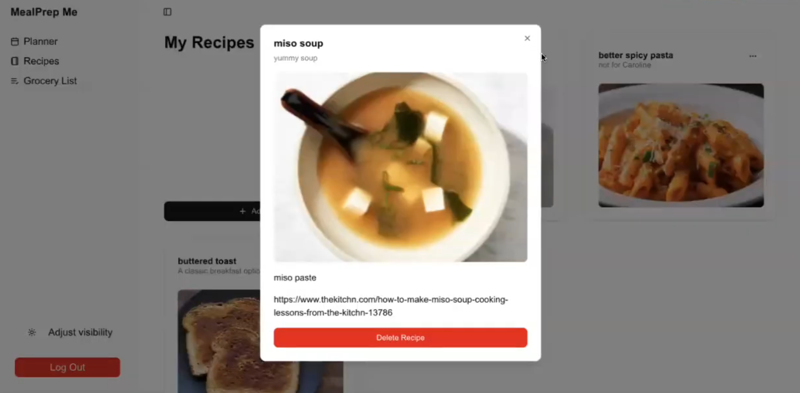
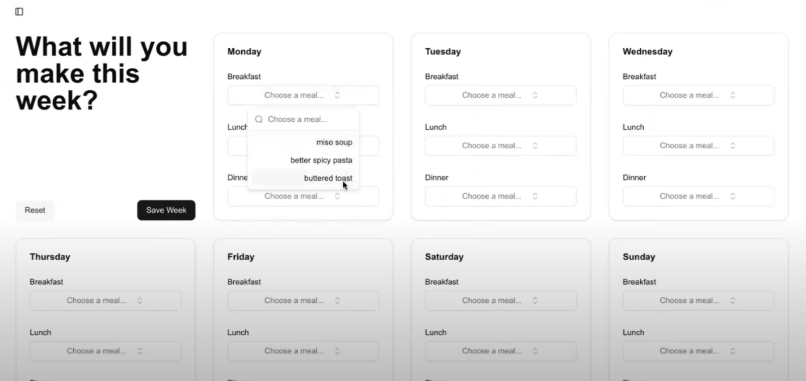
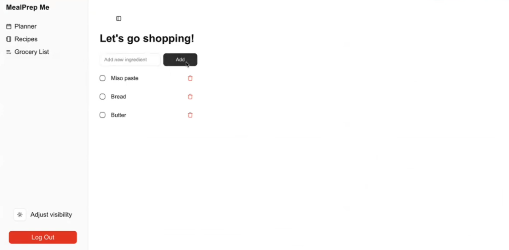

# MealPrep Me

> Developed by [Caroline Bryan](https://github.com/cgbryan1) and [Katie Brown](https://github.com/kgbrown5) for Ajay Gandecha's COMP 426: Modern Web Programming at UNC-Chapel Hill.

Meet MealPrep Me! This website helps users in planning out their weekly meals, simplifying recipe storage, grocery planning, and nutrition goals.

## Current Features

### Recipe Cards

Users can create, delete, and view their saved recipes. Recipes include a title, a list of ingredients, and optional photos, description, instructions or links.

### Meal Planning

Plan each day's meals ahead of time by selecting your meal from the dropdown menu! Save your week each time you make any changes, or reset it completely for a fresh start.

### Grocery List

Users can add, remove, and check off items on their grocery lists.

## Architecture

MealPrep Me is built with a modular approach, organized around distinct feature areas:

* Frontend (Next.js): Pages and components are organized by functionality for clarity and reuse.

* Database (Supabase): Stores user information, hierarchical notes, and compiled code, while also supporting real-time updates.

* Styling (Shadcn/ui + Tailwind): Ensures a cohesive, theme-aware user interface.

* Custom Hooks & Contexts: Streamline the management of application state, user data, and theme preferences.

This structure enhances maintainability, supports isolated feature testing, and enforces a clean separation of concerns.

## Project Management
We used Figma ([mockup here](https://www.figma.com/design/34kaSJM9V8IHBJAV7wohMd/Comp426?node-id=2-287&t=I6Vzqogk3gwSAYMj-1)) to create interactive wireframes for our feature before developing and Github project boards to keep track of tickets' status. We followed Google’s code review guidelines as well as their limit on AI contributions to code (we estimate under 10% of our project includes AI generated code).

## Built Using

